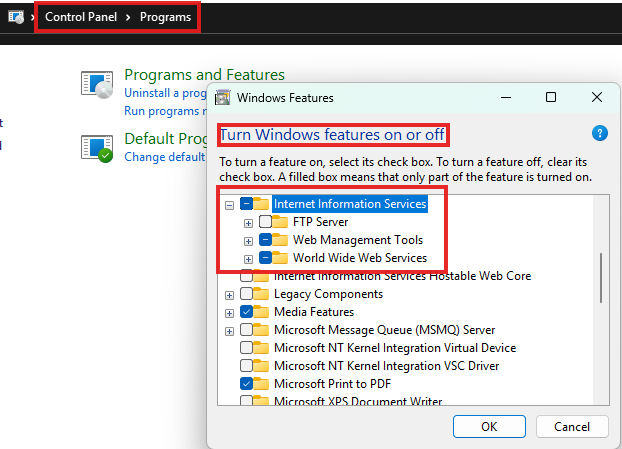
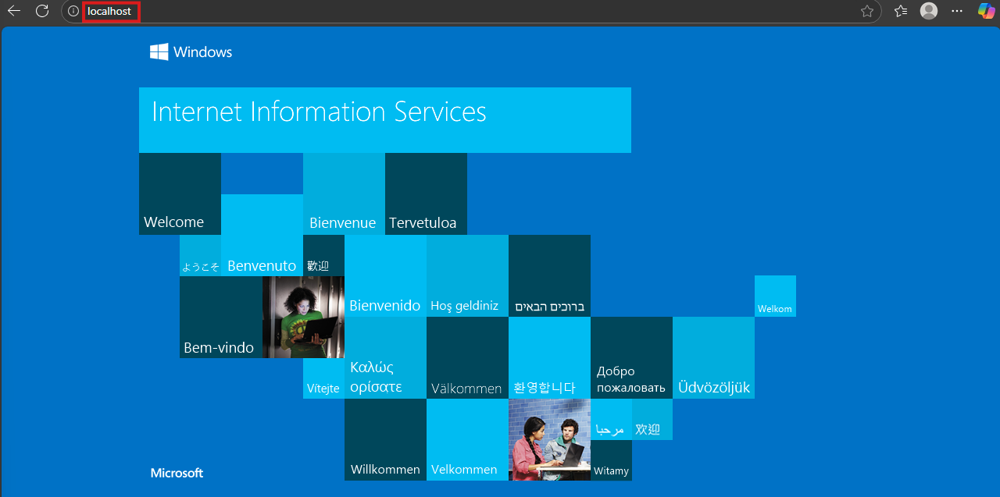
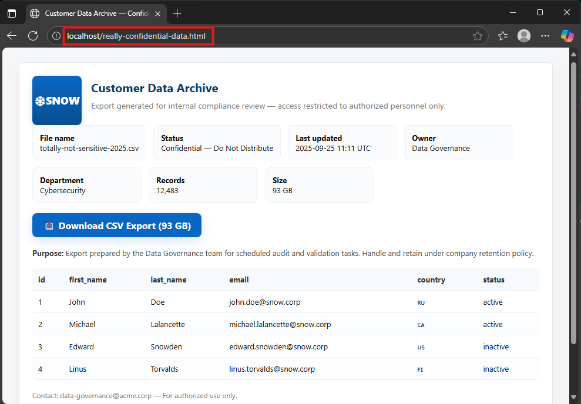
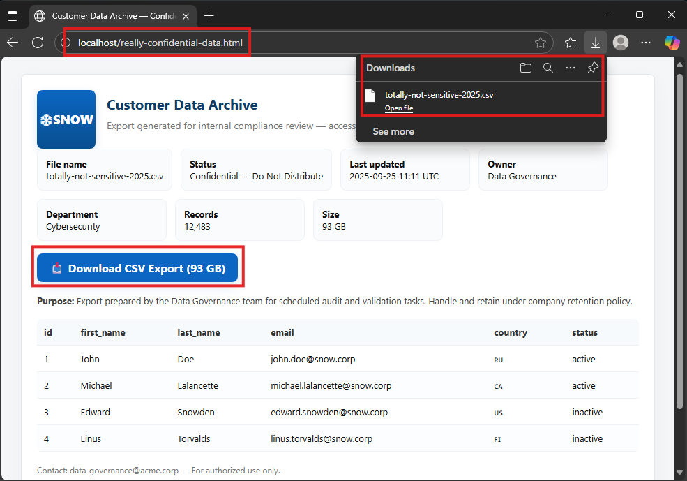
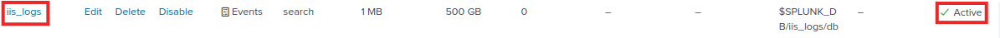
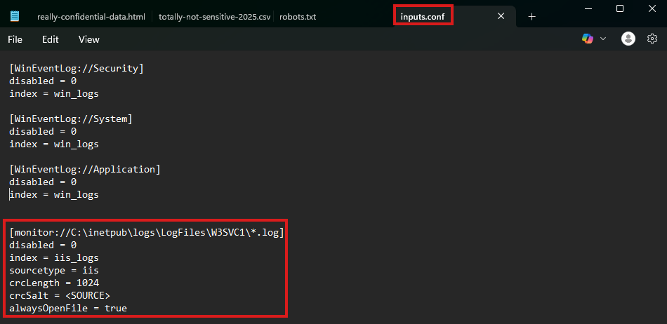
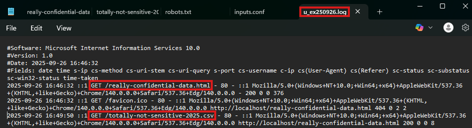
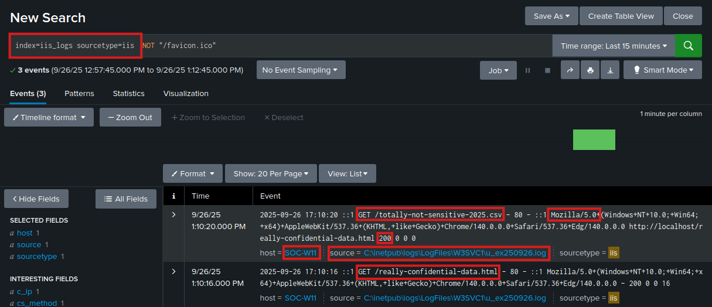
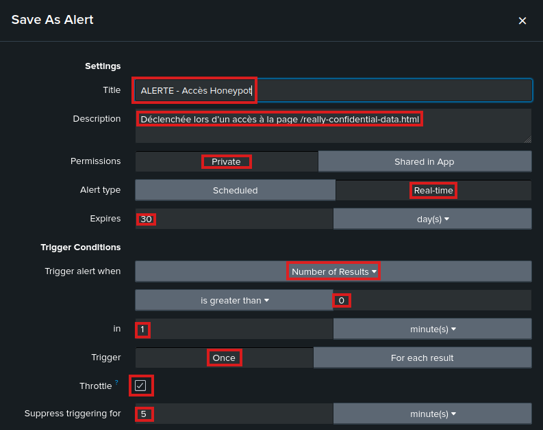

## 📑 Table des matières

- [Phase 1 — Réseaux virtuels](#phase-1---réseaux-virtuels)
  - [VMnet1 (Host-Only)](#vmnet1-host-only)
  - [VMnet8 (NAT/DHCP)](#vmnet8-natdhcp)

- [Phase 2 — Configuration des VMs](#phase-2---configuration-des-vms)
  - [SOC-Splunk-Server](#️-soc-splunk-server)
  - [SOC-W11](#️-soc-w11)
  - [SOC-ATK](#️-soc-atk)
  - [SOC-Workstation](#️-soc-workstation)

- [Phase 3 — Installation de Splunk Enterprise](#phase-3---installation-de-splunk-enterprise)


---


## Phase 1 - Réseaux virtuels

### 🎯 Objectif
Mettre en place deux réseaux virtuels sous VMware pour le laboratoire :  
  - Un réseau isolé (Host-Only) pour la communication interne entre les VMs du lab, sans passerelle vers l’extérieur.  
  - Un réseau externe (NAT) pour fournir temporairement un accès internet aux VMs (mises à jour et téléchargements d’outils).  


### VMnet1 (Host-Only)
  - Créer/configurer un réseau Host-Only dédié.  
  - Désactiver le DHCP.
  - Plage IP : `10.7.0.0/24` (adresses attribuées manuellement).
  > **Résultat ✅ :** Les VMs connectées à VMnet1 communiquent entre elles uniquement, sans accès à internet ni au réseau physique de l’hôte.  
  


### VMnet8 (NAT/DHCP)
  - Activé par défaut dans VMware.
  - Laisser le DHCP activé (distribution auto d’adresses).
  - Plage IP : `172.16.0.0/24` (adresses attribuées dynamiquement aux VMs).
  - Ce réseau utilise le NAT (Network Address Translation) pour fournir un accès internet aux VMs.  
  > **Résultat ✅ :** Les VMs connectées à VMnet8 peuvent accéder à internet pour téléchargements et mises à jour. 
  


---

## Phase 2 - Configuration des VMs

### 🎯 Objectif
Déployer et préparer les machines virtuelles du laboratoire : définir les ressources, configurer les interfaces réseau, installer les paquets de base, et effectuer des vérifications simples avant la phase d’application.


### 🖥️ SOC-Splunk-Server
  **Specs** : 
  - OS : 👉 [Ubuntu Server 24.04.03 LTS](https://ubuntu.com/download/server) 
  - vCPU : 4
  - RAM : 12GB
  - Disque : 100GB
  - NIC1 : Host-only (`10.7.0.10/24`)
  - NIC2 : NAT/DHCP (`172.16.0.x/24`) - temporaire


  **Configuration réseau** :
  - Choisir installation minimale pour garder contrôle sur les paquets installés.
  
  - Configuration de **eth0** – réseau interne (Host‑Only, adresse statique)
    - Adresse IPv4 : `10.7.0.10`
    - DNS : `8.8.8.8`
        
    > 💡 Pourquoi pas de Gateway? Le réseau host-only est non routé : indiquer une gateway pousserait tout le trafic non-local vers un chemin inexistant et provoquerait des pertes de connectivité.
    

  - Configuration de **eth1** – réseau externe (NAT, adresse dynamique via DHCP) :
    - Mode : DHCP automatique.
    - L’interface reçoit une IP dynamique (ex : `172.16.0.129`).
        
    > 💡 Fournit accès Internet (mises à jour + téléchargement de Splunk).  
    

  - Après le reboot de la machine, installer paquets essentiels et activer SSH :
      ```bash
      # Installer paquets
      sudo apt update
      sudo apt install -y openssh-server iputils-ping curl net-tools

      # Activer/démarrer SSH au boot
      sudo systemctl enable --now ssh

      # Vérifier SSH
      systemctl status ssh
      ```


  **✅ Vérifications** :  
  - `ip -br a` → confirme la présence des deux interfaces (`10.0.0.10` et `172.16.0.129`).
  - `ping 8.8.8.8 -c 3` → vérifie la connectivité Internet.  
   


> ⚠️ Prendre un snapshot de la VM juste avant d’installer Splunk, afin de pouvoir revenir rapidement en cas de problème.

---

### 🖥️ SOC-W11
  **Specs** : 
  - OS : 👉 [Microsoft Windows 11 ISO](https://www.microsoft.com/en-us/software-download/windows11?msockid=3093134cf4a46e83086606b8f5856f87)
  - vCPU : 2
  - RAM : 4GB
  - Disque : 60GB
  - NIC1 : Host-only (`10.7.0.20/24`)
  - NIC2 : NAT/DHCP (`172.16.0.x/24`) - temporaire

  **Configuration réseau** :  
  - Configuration de **eth0** – réseau interne (Host‑Only, adresse statique)  
      1. `Win + R` → taper `ncpa.cpl` → OK (ouvre directement Connexions réseau)
      2. Ethernet → Propriétés → Internet Protocol Version 4 (TCP/IPv4)  

    

  - Configuration de **eth1** – réseau externe (NAT, adresse dynamique via DHCP) :
    - Mode : DHCP automatique.
    - L’interface reçoit une IP dynamique (ex : `172.16.0.130`).

    


  **✅ Vérifications** :  
  - `ipconfig` → confirme la présence des deux interfaces (`10.0.0.20` et `172.16.0.130`).
  - `ping 8.8.8.8 -n 3` → vérifie la connectivité Internet.
  - `ping 10.7.0.10 -n 3` → vérifie la connectivité avec le serveur Splunk.  
     
   


> ⚠️ Prendre un snapshot "clean" de la VM en cas d'incident.

---

### 🖥️ SOC-ATK
  **Specs** : 
  - OS : 👉 [Kali Linux ](https://www.kali.org/)
  - vCPU : 2
  - RAM : 4GB
  - Disque : 40GB
  - NIC1 : Host-only (`10.7.0.30/24`)
  - NIC2 : NAT/DHCP (`172.16.0.x/24`) - temporaire

  **Configuration réseau (netplan)** :  
  - Interface **eth0** – réseau interne (Host‑Only, adresse statique)
    ```bash
    sudo nmcli con add type ethernet ifname eth0 con-name eth0-static ipv4.addresses 10.7.0.30/24 ipv4.dns "8.8.8.8 1.1.1.1" ipv4.method manual
    sudo nmcli con up eth0-static
    ```

  - Interface **eth1** – réseau externe (NAT, adresse dynamique via DHCP)
    ```bash
    sudo nmcli con add type ethernet ifname eth1 con-name eth1-dhcp ipv4.method auto
    sudo nmcli con up eth1-dhcp
    ```
       

    > 💡 Remarque : selon la version de Kali, les interfaces peuvent être renommées (ex : ens33, ens34, etc.).    
    >  Identifiez les noms exacts avec la commande `ip -br a` et adaptez les paramètres `ifname` en conséquence.  

  **✅ Vérifications** :  
  - `ip -br a` → confirme la présence des deux interfaces (`10.0.0.30` et `172.16.0.131`).
  - `ping 8.8.8.8 -c 3` → vérifie la connectivité Internet.
  - `ping 10.7.0.[10-20] -c 3` → vérifie la connectivité avec les différentes VMs.
        
         

  > ⚠️ Pour autoriser le ping vers la machine Windows, il faut activer la règle **ICMPv4-In** dans le pare-feu de la machine Windows.    
      
  > Une fois la règle activée, la commande `ping 10.7.0.20 -c 3` confirme la connectivité.  


> ⚠️ Prendre un snapshot "clean" de la VM en cas d'incident.

  ---


### 🖥️ SOC-Workstation
  **Specs** : 
  - OS : 👉 [Ubuntu Desktop 24.04.3 LTS](https://ubuntu.com/download/desktop)
  - vCPU : 4
  - RAM : 8GB
  - Disque : 40GB
  - NIC1 : Host-only (`10.7.0.40/24`)
  - NIC2 : NAT/DHCP (`172.16.0.x/24`) - temporaire

  **Configuration réseau** :
  - Configuration de **eth0/ens33** – réseau interne (Host‑Only, adresse statique)
    - Adresse IPv4 : `10.7.0.40`
    - Netmask : `255.255.255.0`
    - DNS : `8.8.8.8, 1.1.1.1`
    
    


  - Configuration de **eth1/ens34** – réseau externe (NAT, adresse dynamique via DHCP) :
    - Dans IPv4 : IPv4 Method = Automatic (DHCP).
    - L’interface reçoit une IP dynamique (ex : `172.16.0.132`).


  **✅ Vérifications** :  
  - `ip -br a` → confirme la présence des deux interfaces  (`10.0.0.40` et `172.16.0.132`).
  - `ping 8.8.8.8 -c 3` → vérifie la connectivité Internet.
  - `ping 10.7.0.[10-30] -c 3` → vérifie la connectivité avec les différentes VMs.

        
      

> ⚠️ Prendre un snapshot "clean" de la VM en cas d'incident.

---

## 📊 Tableau Récapitulatif
| VM                | OS                   | eth0 (Host-only) | eth1 (NAT/DHCP) | Rôle            |
| ----------------- | -------------------- | ---------------- | --------------- | --------------- |
| SOC-Splunk-Server | Ubuntu Server 24.04  | 10.7.0.10/24     | DHCP            | Collecte & SIEM |
| SOC-W11           | Windows 11           | 10.7.0.20/24     | DHCP            | Victime         |
| SOC-Kali          | Kali Linux           | 10.7.0.30/24     | DHCP            | Attaquant       |
| SOC-Workstation   | Ubuntu Desktop 24.04 | 10.7.0.40/24     | DHCP            | Analyste        |


---

## Phase 3 - Installation de Splunk Enterprise

### 🎯 Objectif  
Installer Splunk Enterprise sur la VM `SOC-Splunk-Server`, activer le service, configurer l’autostart et valider l’accès au tableau de bord depuis la station analyste.


### 1. Téléchargement de Splunk Enterprise  
  - Naviguer sur la page [Splunk Enterprise](https://www.splunk.com/en_us/download/splunk-enterprise.html).  
  - Créer un compte Splunk et choisir l’installateur Linux `.deb`.  
  - Copier le lien `wget` fourni par Splunk.  
> 💡 Cette URL sera utilisée plus tard avec `wget`depuis le serveur Ubuntu.  
     


### 2. Connexion SSH 
  - Depuis la VM SOC-Workstation (Ubuntu Desktop), se connecter sur le serveur Ubuntu via SSH :  
    ```bash
    ssh splunk-admin@10.7.0.10
    ```
      


### 3. Récupération et installation
  - Récupérer le fichier `.deb` avec `wget` :  
    ```bash
    wget -O splunk.deb "<URL_copiée_avec_wget>"
    ```  
    
      
    > N.B. : `-O` nomme spécifiquement le fichier `splunk.deb` (beaucoup mieux que le long string par défaut).

  - Installer le paquet Splunk :  
    ```bash
    sudo dpkg -i splunk.deb
    ```  
  - Lancer Splunk et accepter la license :
    ```bash
    sudo /opt/splunk/bin/splunk start --accept-license
    ```  
  - Créer le compte admin (`splunk-admin`) et lui associer un mot de passe approprié.
    > 💡 Futurs credentials pour vous connecter via l'interface web.  
  - L'URL d'accès est indiquée à la fin du téléchargement : `http://10.7.0.10:8000`  

  - Pour faire démarrer automatiquement Splunk au boot :
    ```bash
    sudo /opt/splunk/bin/splunk enable boot-start
    ```
  - Vérifier finalement que le service est up and running :
    ```bash
    sudo /opt/splunk/bin/splunk status
    ```  
    > **Résultat ✅ :** `splunkd` en cours d’exécution (PID xxxx) et tous les helpers actifs.  


### 4. Accès au Splunk Dashboard
  - Sur la VM SOC‑Workstation :  
    - Ouvrir Firefox.  
    - Saisir `http://10.7.0.10:8000`.  
    - La page de connexion Splunk s’affiche.  
      
    - Se connecter avec les identifiants créés précédemment.  
  > **Résultat ✅ :** Le tableau de bord Splunk Enterprise apparaît, confirmant que le serveur est fonctionnel et joignable depuis le réseau interne.  
      


### 📌 Bilan
  - Splunk installé, démarrage automatique configuré, service actif sur le port `8000`.  
  - Interface web accessible depuis la station analyste.    
  - Prêt pour la phase suivante : configuration des inputs, forwarders et premières recherches.    


> ⚠️ Snapshot : prenez un snapshot de la VM SOC‑Splunk‑Server avant de poursuivre.


---

## Phase 4 - Déploiement du Universal Forwarder (SOC-W11)


### 🎯 Objectif
Installer et configurer le **Splunk Universal Forwarder** sur la VM victime (SOC-W11), lui indiquer l’indexer (`10.0.0.10:9997`), définir les sources d’événements (Security, System, Application) et valider l’ingestion des événements dans l’index `win_logs`.  


### 1. Téléchargement du Forwarder
  - Ouvrir un navigateur depuis SOC-W11.    
  - Accéder à la page de téléchargement du [Splunk Universal Forwarder](https://www.splunk.com/en_us/download/universal-forwarder.html?locale=en_us).    
  - Télécharger le 64-bit Windows MSI localement.   
      


### 2. Installation du Forwarder
  - Lancer le `.msi` et suivre l’assistant :  
    - Chemin d’installation : C:\Program Files\SplunkUniversalForwarder  
    - Type : On-Premise (configuré par défaut)  
    - Exécuter en tant que Local System (option recommandée)   
  - Définir un compte d’administration local pour le UF (ex : `splunk_agent` avec un mot de passe robuste).
  - Ignorer la configuration du Deployment Server (non utilisée dans ce lab).  
  - Lors de la configuration de l’**Indexer**, définir :  
    - Host/IP : `10.0.0.10`  
    - Port : `9997`     
        
    > ✅ Cette étape génère automatiquement un fichier `outputs.conf`.  


### 3. Activation du port de réception sur l’indexer
Même si l’IP de l’indexer (`10.7.0.10`) et le port de transmission (`9997`) ont été définis lors de l’installation du UF, l'**indexer** doit explicitement être configuré pour écouter sur ce port.     
  - Le Forwarder définit uniquement la destination des journaux (`outputs.conf`).  
  - L’Indexer doit, quant à lui, être configuré pour accepter les flux entrants sur ce port, sans quoi les événements seront ignorés.  

  - Depuis l’interface Splunk (`http://10.7.0.10:8000`) :  
    1. Accéder à **Settings ➝ Forwarding and Receiving**.  
    2. Dans **Receive data**, cliquer sur **Configure receiving**.  
    3. Sélectionner **New Receiving Port** et ajouter le port `9997`.  
    4. Sauvegarder la configuration.    
       


  > 💡 Vérification côté serveur :  
  > ```bash
  > sudo ss -tulnp | grep 9997
  > ```  
  > Le processus `splunkd` doit apparaître en écoute sur TCP/9997.  


**Résultat ✅ :** L’indexer est désormais configuré pour recevoir les logs transmis par les UF sur le port 9997, garantissant la continuité du pipeline de collecte.


### 4. Définition des sources de logs via `inputs.conf`  
Après avoir relié le UF à l’indexer (`outputs.conf`), définir quels logs Windows seront collectés.  
  
Selon la [documentation officielle](https://docs.splunk.com/Documentation/Splunk/latest/Admin/Inputsconf), dans un environnement **sans Deployment Server** (comme dans ce lab), cela se fait par l'entremise du fichier de configuration `inputs.conf`, localisé dans :  
  `C:\Program Files\SplunkUniversalForwarder\etc\system\local`   
  
  
  
  - `outputs.conf` → indique **destination** (où envoyer) les données (`10.7.0.10:9997`).  
        
  - `inputs.conf` → indique **sources** à collecter (ex : logs Windows).    

  - Créer manuellement `inputs.conf`, puis ajouter les **stanzas** suivants :   
    ```ini
    [WinEventLog://Security]
    disabled = 0
    index = win_logs
  
    [WinEventLog://System]
    disabled = 0
    index = win_logs

    [WinEventLog://Application]
    disabled = 0
    index = win_logs
    ```
      
      
    > 💡 Ces stanzas activent la collecte des trois canaux de logs Windows les plus critiques (Sécurité, Système et Application) et les centralisent vers l'index `win_logs`.    


  - Après enregistrement, le UF contient désormais :  
    - `outputs.conf` → destination (`10.7.0.10:9997`)  
    - `inputs.conf` → sources de logs à collecter  
    

 
  - Appliquer/valider la configuration
    - Se positionner dans le répertoire `C:\Program Files\SplunkUniversalForwarder\bin`  
    - Redémarrer et vérifier l'état du service :   
      ```powershell
      .\splunk restart
      .\splunk status
      ```  
    


**Résultat ✅ :** Le service SplunkForwarder redémarre correctement.  
  - `splunk status` → renvoie `SplunkForwarder: Running`, confirmant que le daemon `splunkd` tourne en arrière-plan et que les logs sont prêts à être envoyés à l’indexer (`10.7.0.10`).  


  


### 5. Création de l'index `win_logs` 
  - Retour sur notre interface Splunk (`http://10.7.0.10:8000`)  
    - Aller dans Settings ➝ Indexes  
    - Cliquer sur New Index et configurer :  
      - Index Name : `win_logs`  
      - Laisser les autres paramètres par défaut  
    - Valider en cliquant sur Save  
    

    > ✅ L’index `win_logs` est désormais prêt à recevoir les événements.  

  - Vérification par **requête SPL**
    - Dans l’application Search & Reporting, exécuter :
      ```spl
      index="win_logs"
      ```  
        
        
      > ✅ Apparition rapide d’événements confirmant la bonne collecte des logs.
      

      
### 📌 Bilan  
  - Universal Forwarder installé et configuré avec succès sur SOC-W11  
  - Transmission confirmée vers l’indexer (port `9997` activé)  
  - Sources définies (Security, System, Application)  
  - Index `win_logs` créé et alimenté avec les premiers événements  
    
    

> ⚠️ Snapshot : prenez un snapshot des VMs SOC‑Splunk‑Server et SOC-W11 avant de poursuivre.  


---


## Phase 5 - Configuration du Honeypot

### 🎯 Objectif  
  - Déployer un honeypot web sur IIS dans la VM SOC-W11 pour détecter des activités de reconnaissance.   
  - Créer une page leurre (`/really-confidential-data.html`) ainsi qu’un faux fichier CSV (`totally-not-sensitive-2025.csv`) accompagnés d'un `fichier robots.txt` volontairement mal configuré pour attirer et identifier les accès suspects.  
  - Les accès sont enregistrés dans les logs IIS, collectés par le Splunk Universal Forwarder puis centralisés dans l’index `iis_logs` du SOC Splunk Server pour analyse/détection en temps réel.  

> ⚠️ Le serveur IIS n’a pas été enrichi d’autres contenus, l’objectif étant de se concentrer sur un seul endpoint vulnérable pour la tester détection et les alertes.  


### 1. Installation IIS
  - Ouvrir **Control Panel → Programs → Turn Windows features on or off**.   
  - Activer **Internet Information Services** (cocher *Web Management Tools* et *World Wide Web Services*).    
      
  - Vérifier le service en ouvrant `http://localhost` sur la VM : la page d’accueil IIS doit s’afficher.    
        


### 2. Créer le contenu du Honeypot
  - Créer page leurre HTML `really-confidential-data.html`  
    - Ouvrir le Notepad (ou tout éditeur texte) avec les droits administrateur.  
    - Copier‑coller le code HTML fourni.  
    ```html
    <!doctype html>
    <html lang="en">
    <head>
      <meta charset="utf-8">
      <meta name="viewport" content="width=device-width,initial-scale=1">
      <title>Customer Data Archive — Confidential</title>
      <style>
        :root{--brand:#0b66c3;--muted:#777;--card:#fff;--bg:#f4f6f8}
        body{font-family: "Segoe UI", Roboto, Arial, sans-serif;background:var(--bg);color:#111;margin:28px}
        .container{max-width:1100px;margin:0 auto;background:var(--card);border:1px solid #e3e6ea;border-radius:8px;padding:22px;box-shadow:0 8px 30px rgba(15,30,45,0.04)}
        header{display:flex;align-items:center;gap:16px}
        .logo{width:84px;height:84px;background:linear-gradient(180deg,#0b66c3,#084f8f);color:#fff;display:flex;align-items:center;justify-content:center;border-radius:8px;font-weight:700;font-size:18px;box-shadow:0 4px 12px rgba(11,102,195,0.18)}
        .logo span{display:flex;align-items:center;gap:8px}
        .logo .flake{font-size:22px}
        h1{margin:0;font-size:20px;color:#0b3b66}
        .meta{color:var(--muted);margin:8px 0 18px;font-size:14px}
        .details{display:flex;flex-wrap:wrap;gap:12px;margin-bottom:18px}
        .details div{background:#fafbfc;padding:12px;border-radius:8px;border:1px solid #eef2f6;font-size:13px;min-width:160px}
        .download{margin:18px 0}
        .btn{display:inline-block;padding:10px 18px;background:var(--brand);color:#fff;border-radius:8px;text-decoration:none;font-weight:700;box-shadow:0 6px 18px rgba(11,102,195,0.16)}
        .btn:hover{background:#094a8f;transform:translateY(-1px);transition:all .12s ease}
        table{width:100%;border-collapse:collapse;margin-top:18px;background:#fff;border-radius:6px;overflow:hidden}
        th,td{padding:10px;border-bottom:1px solid #eef2f6;text-align:left;font-size:13px}
        th{background:#f7fafc;color:#333;font-weight:700}
        tbody tr:nth-child(even){background:#fbfdff}
        footer{margin-top:18px;font-size:12px;color:var(--muted)}
        .legal{margin-top:12px;color:#444;font-size:13px}
        .small-muted{font-size:12px;color:#999;margin-top:8px}
      </style>
    </head>
    <body>
      <div class="container" role="main" aria-labelledby="title">
        <header>
          <div class="logo" aria-hidden="true"><span class="flake">❄</span><strong>SNOW</strong></div>
          <div>
            <h1 id="title">Customer Data Archive</h1>
            <div class="meta">Export generated for internal compliance review — access restricted to authorized personnel only.</div>
          </div>
        </header>
    
        <section>
          <div class="details" aria-label="Export metadata">
            <div><strong>File name</strong><br>totally-not-sensitive-2025.csv</div>
            <div><strong>Status</strong><br>Confidential — Do Not Distribute</div>
            <div><strong>Last updated</strong><br>2025-09-25 11:11 UTC</div>
            <div><strong>Owner</strong><br>Data Governance</div>
            <div><strong>Department</strong><br>Cybersecurity</div>
            <div><strong>Records</strong><br>12,483</div>
            <div><strong>Size</strong><br>93 GB</div>
          </div>
    
          <div class="download">
            <a class="btn" href="totally-not-sensitive-2025.csv" download aria-label="Download CSV Export">📥 Download CSV Export (93 GB)</a>
          </div>
    
          <div class="legal">
            <p><strong>Purpose:</strong> Export prepared by the Data Governance team for scheduled audit and validation tasks. Handle and retain under company retention policy.</p>
          </div>
    <table aria-label="sample preview">
      <thead>
        <tr>
          <th>id</th>
          <th>first_name</th>
          <th>last_name</th>
          <th>email</th>
          <th>country</th>
          <th>status</th>
        </tr>
      </thead>
      <tbody>
        <tr><td>1</td><td>John</td><td>Doe</td><td>john.doe@snow.corp</td><td>🇷🇺</td><td>active</td></tr>
        <tr><td>2</td><td>Michael</td><td>Lalancette</td><td>michael.lalancette@snow.corp</td><td>🇨🇦</td><td>active</td></tr>
        <tr><td>3</td><td>Edward</td><td>Snowden</td><td>edward.snowden@snow.corp</td><td>🇺🇸</td><td>inactive</td></tr>
        <tr><td>4</td><td>Linus</td><td>Torvalds</td><td>linus.torvalds@snow.corp</td><td>🇫🇮</td><td>inactive</td></tr>
      </tbody>
    </table>
    
    
          <footer>
            <p>Contact: data-governance@acme.corp — For authorized use only.</p>
            <p class="small-muted">This document and the contained data are proprietary and confidential. Unauthorized access, use or distribution is strictly prohibited and may result in disciplinary or legal action.</p>
          </footer>
        </section>
      </div>
    </body>
    </html>
    ```

    - Enregistrer le fichier dans le répertoire IIS sous  `C:\inetpub\wwwroot\really-confidential-data.html`  
    - Vérifier l’accès : `http://localhost/really-confidential-data.html`  
         

    > 💡 Cette page imite un document interne sensible et contient un lien de téléchargement destiné à piéger les curieux.    


  - Créer fichier CSV `totally-not-sensitive-2025.csv`
    - Ouvrir le Notepad (ou tout éditeur texte) avec les droits administrateur.  
    - Copier-coller le contenu CSV :  
     ```csv
     ID;Col1;Col2;Col3;Col4;Col5
     0;"*** WARNING ***";"Nice try!";"You just fell into a honeypot.";"💻";"Caught"
     1;"This incident has been logged.";"Your IP has been sent to Santa Claus.";"🎅";"Naughty List"
     ```  
    - Enregistrer le fichier dans le répertoire IIS sous `C:\inetpub\wwwroot\really-confidential-data.html`   
    - Cliquer sur le lien de téléchargement pour vérifier le logging IIS.  
    
 
    > 💡 Ce fichier ne contient évidemment aucune donnée réelle, uniquement un message d’avertissement destiné aux curieux non autorisés.  


### 3. Créer l'appât `robots.txt`
  - Toujours dans `C:\inetpub\wwwroot`, créer un fichier texte intitulé `robots.txt`.  
  - Copier-coller le contenu texte :  
    ```txt
    User-agent: *
    Disallow: /really-confidential-data.html
    Disallow: /totally-not-sensitive-2025.csv
    ```
  > 💡 Ce fichier ne constitue en aucun cas une mesure de sécurité ; au contraire, il sert volontairement d’appât : il trahit la présence de ressources fictives aux outils de reconnaissance automatisés (gobuster, dirb, nikto, etc.).


### 4. Création de l'index `iis_logs`
Avant d’envoyer les journaux IIS vers Splunk, il faut créer un index de destination. Sans cet index, les logs seraient ignorés.   
  - Sur l'interface Splunk, aller sur `Settings → Indexes → New Index`.   
    - Nommer l'index `iis_logs` et laisser les autres options par défaut.  
    - Sauvegarder.  
        
  > 💡 L'index apparaît ensuite dans la liste avec le statut Active et recevra les logs IIS.   


### 5. Configurer le UF pour envoyer événements vers `iis_logs`
Pour collecter les logs IIS d’une machine Windows, il faut éditer manuellement le fichier `inputs.conf` du Forwarder afin de préciser :
- le chemin des logs IIS (C:\inetpub\logs\LogFiles\W3SVC1\*.log),  
- le sourcetype (iis),  
- l’index de destination (iis_logs).

  - Modification de `inputs.conf` :
    - Sur la VM SOC-W11, éditer `C:\Program Files\SplunkUniversalForwarder\etc\system\local\inputs.conf`, ajouter le bloc suivant :     
      ```ini
      [monitor://C:\inetpub\logs\LogFiles\W3SVC1\*.log]
      disabled = 0
      index = iis_logs
      sourcetype = iis
      crcLength = 1024
      crcSalt = <SOURCE>
      alwaysOpenFile = true
      ```
      
 
    - Ce paramétrage permet au Forwarder de :  
      - surveiller de tous les fichiers `.log` du répertoire IIS,  
      - envoyer les événements vers l’index `iis_logs`,  
      - utiliser le `sourcetype=iis` pour un parsing structuré (txt brut → champ structuré),   
      - `crcSalt` et `alwaysOpenFile` assurent une lecture continue et évitent les doublons.  
     
  - Redémarrer le service pour appliquer la nouvelle configuration.
    ```powershell
    cd 'C:\Program Files\SplunkUniversalForwarder\bin\'
    .\splunk restart
    ```

  - Génération événements et vérification des logs
    - Accéder au honeypot `http://localhost/really-confidential-data.html`.  
    - Télécharger le CSV pour générer davantage de bruit.  
    - Valider qu'un log a bien été créé dans le répertoire `C:\inetpub\logs\LogFiles\W3SVC1\`.  
      

  - Vérification dans Splunk
    - Depuis l'onglet `Search & Reporting`, lancer une recherche :
      ```spl
      index=iis_logs sourcetype=iis
      ```
      

    > ✅ Les événements sont bien ingérés dans Splunk :  
    > - Source correcte (`C:\inetpub\logs\LogFiles\W3SVC1\`)  
    > - Hôte identifié comme `SOC-W11`  
    > - Requêtes HTTP `GET` sur `/really-confidential-data.html` et `/totally-not-sensitive-2025.csv`  
      
  

**Résultat ✅ :** Le honeypot web est opérationnel, les journaux IIS sont bien transmis et indexés dans Splunk.
La prochaine étape consiste à mettre en place une alerte temps réel pour détecter automatiquement tout accès au leurre.  


---


## Phase 6 - Configuration Alertes

### 🎯 Objectif  
Détecter, en temps réel, toute requête HTTP vers la page honeypot `/really-confidential-data.html` et :
  - enregistrer l’événement dans Triggered Alerts (sévérité High) ;  
  - envoyer une notification e‑mail (SMTP Mailtrap) ;  
  - consigner les champs pertinents dans le lookup CSV `honeypot_hits.csv`.  


**Créer l'alerte :**  
  - Depuis `Search & Reporting`, après avoir rentré la requête (`index=iis_logs sourcetype=iis cs_uri_stem="/really-confidential-data.html`, cliquer sur `Save As → Alert`  
  - Title : ALERTE - Accès Honeypot 
  - Description : Déclenchée lors d’un accès à la page /really-confidential-data.html (reconnaissance/énumération).  
  - Permissions : Private (puisqu'on est dans un lab isolé).  
  - Alert Type : Real-time (pour détection immédiate).  
  - Expires : 30 jours

  > 💡 Pour éviter que des outils d’énumération tels que `Gobuster`, `Dirb`, etc. ne génèrent une avalanche d’alertes, j’ai configuré l’alerte afin qu’elle ne se déclenche qu’une fois par rafale, en utilisant une fenêtre de 1 minute et un throttling de 5 minutes. Ainsi, les accès répétés dans ce laps de temps sont ignorés, limitant le bruit tout en conservant la visibilité sur chaque incident.  

  - Trigger Condition : Number of Results > 0   
  - Time Window : 1 minute 
  - Trigger Alert : Once  
  - Suppress triggering for : 5 minutes (throttle)  
  

  > ✅ En résumé, l’alerte se déclenche dès la première visite du Honeypot, puis, grâce à un throttle de 5 minutes, les accès répétés sont ignorés. L’événement reste consigné et consultable, mais 1 seul e‑mail et 1 seule alerte sont envoyés pour chaque fenêtre d’incident.  


**Trigger Actions :**  
Définir ce qui arrive lorsqu'une alerte est triggered.   
  - 


    


