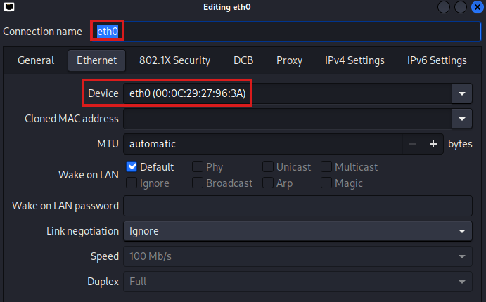
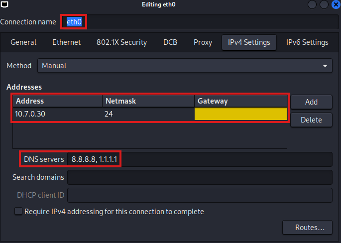
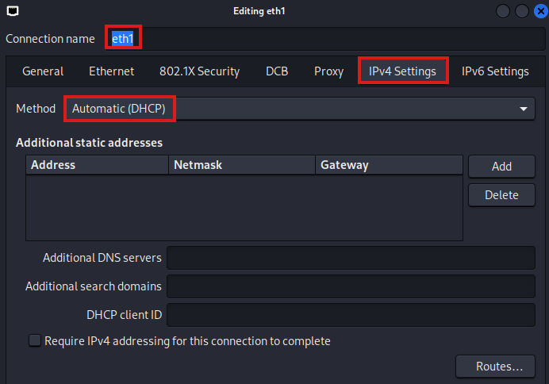
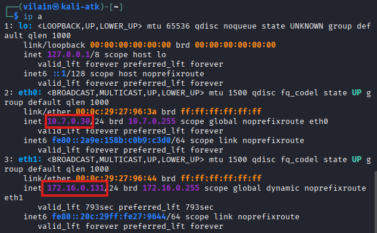
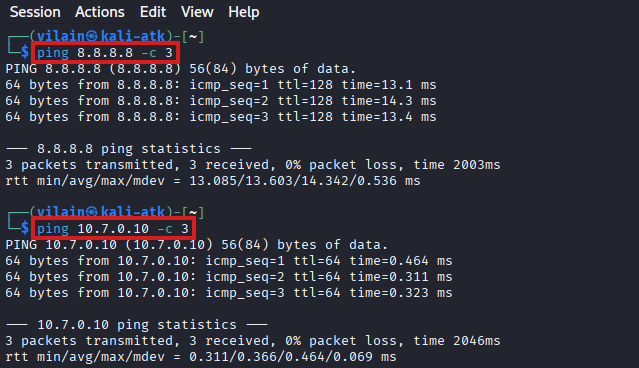
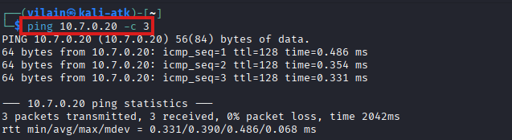

## Phase 1 - Réseaux virtuels

### 🎯 Objectif
Définir 2 réseaux virtuels sous VMware : un réseau **isolé** pour la communication interne du laboratoire et un réseau **NAT** permettant un accès Internet temporaire afin d’installer les outils/updates nécessaires..

### VMnet1 (Host-Only)
  - Créer/configurer un réseau Host-Only dédié.  
  - Désactivez le DHCP.  
  -  IP statiques seront attribuées dans le subnet `10.7.0.0/24`.  
  > **Résultat ✅ :** Les VM connectées à ce réseau ne voient que les autres VM du même réseau (aucune sortie vers Internet).  
  


### VMnet8 (NAT/DHCP)
  - Activé par défaut.  
  - Laisser DHCP activé.  
  > **Résultat ✅ :** Les VM rattachées à ce réseau obtiennent une adresse IP via DHCP et peuvent accéder à Internet pour télécharger les outils et effectuer les updates nécessaires.  
  


---

## Phase 2 - Configuration des VMs

### 🎯 Objectif
Déployer et préparer les machines virtuelles du laboratoire : définir les ressources, configurer les interfaces réseau, installer les paquets de base, et effectuer des vérifications simples avant la phase d’application.


### 🖥️ SOC-Splunk-Server
  **Specs** : 
  - OS : 👉 [Ubuntu Server 24.04.03 LTS](https://ubuntu.com/download/server) 
  - vCPU : 4
  - RAM : 12GB
  - Disque : 100GB
  - NIC1 : Internal - Host-only (`10.7.0.10/24`)
  - NIC2 : External - NAT/DHCP (temporaire)


  **Configurations** :  
  - Choisir installation minimale pour garder contrôle sur les paquets installés.
  
  - Configuration de **eth0** (réseau interne)
    - Adresse IPv4 : `10.7.0.10`
    - DNS : `8.8.8.8`
        
    > 💡 Pourquoi pas de Gateway? Le réseau host-only est non routé : indiquer une gateway pousserait tout le trafic non-local vers un chemin inexistant et provoquerait des pertes de connectivité.
    

  - Configuration de **eth1** (réseau externe/NAT) :
    - Mode : DHCP automatique.
    - L’interface reçoit une IP dynamique (ex : `172.16.0.129`).
        
    > 💡 Fournit accès Internet (mises à jour + téléchargement de Splunk).  
    

  - Après le reboot de la machine, installer paquets nécessaires :
    ```bash
    sudo apt update
    sudo apt install -y openssh-server iputils-ping curl net-tools
    sudo systemctl enable --now ssh
    ```

  - Activer et démarrer le service SSH au boot :
      ```bash
      # Installer
      sudo apt update
      sudo apt install -y openssh-server
    
      # Activer/démarrer au boot
      sudo systemctl enable --now ssh

      # Valider/vérifier le service
      systemctl status ssh
      ```


  **✅ Vérifications** :  
  - `ip a` → confirme la présence des deux interfaces (`10.0.0.10` et `172.16.0.129`).
  - `ping 8.8.8.8 -c 3` → vérifie la connectivité Internet.  
   


> 💡 Prendre un snapshot de la VM juste avant d’installer Splunk, afin de pouvoir revenir rapidement en cas de problème.

---

### 🖥️ SOC-W11 (Victime)
  **Specs** : 
  - OS : 👉 [Microsoft Windows 11 ISO](https://www.microsoft.com/en-us/software-download/windows11?msockid=3093134cf4a46e83086606b8f5856f87)
  - vCPU : 2
  - RAM : 4GB
  - Disque : 60GB
  - NIC1 : Internal - Host-only (`10.7.0.20/24`)
  - NIC2 : External - NAT/DHCP (temporaire)

  **Configurations** :  
  - Configuration de **eth0** (réseau interne)
     ``` 
       Network Connections  
         └─ Ethernet0  
             └─ Properties 
                 └─ Internet Protocol Version 4 (TCP/IPv4)  
                    └─ ON
      ``` 

    

  - Configuration de **eth1** (réseau externe/NAT) :
    - Mode : DHCP automatique.
    - L’interface reçoit une IP dynamique (ex : `172.16.0.130`).

    


  **✅ Vérifications** :  
  - `ipconfig` → confirme la présence des deux interfaces (`10.0.0.20` et `172.16.0.130`).
  - `ping 8.8.8.8 -n 3` → vérifie la connectivité Internet.
  - `ping 10.7.0.10 -n 3` → vérifie la connectivité avec le serveur Splunk.  
     
   


> 💡 Prendre un snapshot "clean" de la VM en cas d'incident.

---

### 🖥️ SOC-Kali (Attaquant)
  **Specs** : 
  - OS : 👉 [Kali Linux ](https://www.kali.org/)
  - vCPU : 2
  - RAM : 4GB
  - Disque : 40GB
  - NIC1 : Internal - Host-only (`10.7.0.30/24`)
  - NIC2 : External - NAT/DHCP (temporaire)

  **Configurations** :  
  - Ajout des connexions (à répéter pour eth0 et eth1)
     ``` 
       Advanced Network Configuration  
         └─ +
             └─ Device 
                 └─ eth0 
                    └─ IPv4 Settings
                       └─ Add
                         └─ Ajouter informations spécifiques
     ``` 

  - Configuration de **eth0** (réseau interne)
    - Adresse IPv4 : `10.7.0.30`
    - Netmask : `255.255.255.0`
    - DNS : `8.8.8.8, 1.1.1.1`
    
    
    

    
  - Configuration de **eth1** (réseau externe/NAT) :
    - Dans IPv4 Settings : Method = Automatic (DHCP).
    - L’interface reçoit une IP dynamique (ex : `172.16.0.131`).

    

  **✅ Vérifications** :  
  - `ip a` → confirme la présence des deux interfaces (`10.0.0.30` et `172.16.0.131`).
  - `ping 8.8.8.8 -c 3` → vérifie la connectivité Internet.
  - `ping 10.7.0.[10-20] -c 3` → vérifie la connectivité avec les différentes VMs.

        
         
  
  - Pour autoriser le ping vers la machine Windows, il faut activer la règle **ICMPv4-In** dans le pare-feu.
      
    - Une fois la règle activée, la commande `ping 10.7.0.20 -n 3` confirme la connectivité.  

      


> 💡 Prendre un snapshot "clean" de la VM en cas d'incident.

  ---


### 🖥️ SOC-Workstation
  **Specs** : 
  - OS : 👉 [Ubuntu Desktop 24.04.3 LTS](https://ubuntu.com/download/desktop)
  - vCPU : 4
  - RAM : 8GB
  - Disque : 40GB
  - NIC1 : Internal - Host-only (`10.7.0.40/24`)
  - NIC2 : External - NAT/DHCP (temporaire)

  **Configurations** :
  - Configuration de **eth0/ens33** (réseau interne)
    - Adresse IPv4 : `10.7.0.40`
    - Netmask : `255.255.255.0`
    - DNS : `8.8.8.8, 1.1.1.1`
    
    


  - Configuration de **eth1/ens34** (réseau externe/NAT) :
    - Dans IPv4 : IPv4 Method = Automatic (DHCP).
    - L’interface reçoit une IP dynamique (ex : `172.16.0.132`).


  **✅ Vérifications** :  
  - `ip -br a` → réduit br-uit et confirme la présence des deux interfaces  (`10.0.0.40` et `172.16.0.132`).
  - `ping 8.8.8.8 -c 3` → vérifie la connectivité Internet.
  - `ping 10.7.0.[10-30] -c 3` → vérifie la connectivité avec les différentes VMs.

        
      

> 💡 Prendre un snapshot "clean" de la VM en cas d'incident.

---

## 📊 Tableau Récapitulatif
| VM                | OS                   | eth0 (Host-only) | eth1 (NAT/DHCP) | Rôle            |
| ----------------- | -------------------- | ---------------- | --------------- | --------------- |
| SOC-Splunk-Server | Ubuntu Server 24.04  | 10.7.0.10/24     | DHCP            | Collecte & SIEM |
| SOC-W11           | Windows 11           | 10.7.0.20/24     | DHCP            | Victime         |
| SOC-Kali          | Kali Linux           | 10.7.0.30/24     | DHCP            | Attaquant       |
| SOC-Workstation   | Ubuntu Desktop 24.04 | 10.7.0.40/24     | DHCP            | Analyste        |


