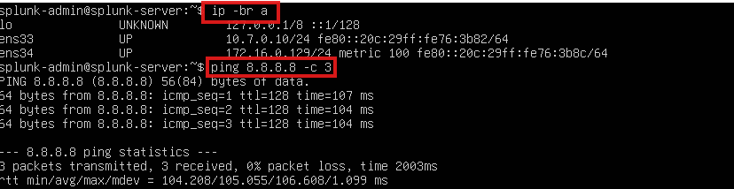

## 📑 Table des matières

- [Phase 1 — Réseaux virtuels](#phase-1---réseaux-virtuels)
  - [VMnet1 (Host-Only)](#vmnet1-host-only)
  - [VMnet8 (NAT/DHCP)](#vmnet8-natdhcp)

- [Phase 2 — Configuration des VMs](#phase-2---configuration-des-vms)
  - [SOC-Splunk-Server](#️-soc-splunk-server)
  - [SOC-W11](#️-soc-w11)
  - [SOC-ATK](#️-soc-atk)
  - [SOC-Workstation](#️-soc-workstation)

- [Phase 3 — Installation de Splunk Enterprise](#phase-3---installation-de-splunk-enterprise)

- [Phase 4 - Déploiement du Universal Forwarder (SOC-W11)](#phase-4---deploiement-du-universal-forwarder-soc-w11)

- [Phase 5 — Détection & Alerting](#phase-5---détection--alerting)
- [Phase 6 — Investigation & Workflows](#phase-6---investigation--workflows)


---


## Phase 1 - Réseaux virtuels

### 🎯 Objectif
Mettre en place deux réseaux virtuels sous VMware pour le laboratoire :  
  - Un réseau isolé (Host-Only) pour la communication interne entre les VMs du lab, sans passerelle vers l’extérieur.  
  - Un réseau externe (NAT) pour fournir temporairement un accès internet aux VMs (mises à jour et téléchargements d’outils).  


### VMnet1 (Host-Only)
  - Créer/configurer un réseau Host-Only dédié.  
  - Désactiver le DHCP.
  - Plage IP : `10.7.0.0/24` (adresses attribuées manuellement).
  > **Résultat ✅ :** Les VMs connectées à VMnet1 communiquent entre elles uniquement, sans accès à internet ni au réseau physique de l’hôte.  
  


### VMnet8 (NAT/DHCP)
  - Activé par défaut dans VMware.
  - Laisser le DHCP activé (distribution auto d’adresses).
  - Plage IP : `172.16.0.0/24` (adresses attribuées dynamiquement aux VMs).
  - Ce réseau utilise le NAT (Network Address Translation) pour fournir un accès internet aux VMs.  
  > **Résultat ✅ :** Les VMs connectées à VMnet8 peuvent accéder à internet pour téléchargements et mises à jour. 
  


---

## Phase 2 - Configuration des VMs

### 🎯 Objectif
Déployer et préparer les machines virtuelles du laboratoire : définir les ressources, configurer les interfaces réseau, installer les paquets de base, et effectuer des vérifications simples avant la phase d’application.


### 🖥️ SOC-Splunk-Server
  **Specs** : 
  - OS : 👉 [Ubuntu Server 24.04.03 LTS](https://ubuntu.com/download/server) 
  - vCPU : 4
  - RAM : 12GB
  - Disque : 100GB
  - NIC1 : Host-only (`10.7.0.10/24`)
  - NIC2 : NAT/DHCP (`172.16.0.x/24`) - temporaire


  **Configuration réseau** :
  - Choisir installation minimale pour garder contrôle sur les paquets installés.
  
  - Configuration de **eth0** – réseau interne (Host‑Only, adresse statique)
    - Adresse IPv4 : `10.7.0.10`
    - DNS : `8.8.8.8`
        
    > 💡 Pourquoi pas de Gateway? Le réseau host-only est non routé : indiquer une gateway pousserait tout le trafic non-local vers un chemin inexistant et provoquerait des pertes de connectivité.
    

  - Configuration de **eth1** – réseau externe (NAT, adresse dynamique via DHCP) :
    - Mode : DHCP automatique.
    - L’interface reçoit une IP dynamique (ex : `172.16.0.129`).
        
    > 💡 Fournit accès Internet (mises à jour + téléchargement de Splunk).  
    

  - Après le reboot de la machine, installer paquets essentiels et activer SSH :
      ```bash
      # Installer paquets
      sudo apt update
      sudo apt install -y openssh-server iputils-ping curl net-tools

      # Activer/démarrer SSH au boot
      sudo systemctl enable --now ssh

      # Vérifier SSH
      systemctl status ssh
      ```


  **✅ Vérifications** :  
  - `ip -br a` → confirme la présence des deux interfaces (`10.0.0.10` et `172.16.0.129`).
  - `ping 8.8.8.8 -c 3` → vérifie la connectivité Internet.  
   


> ⚠️ Prendre un snapshot de la VM juste avant d’installer Splunk, afin de pouvoir revenir rapidement en cas de problème.

---

### 🖥️ SOC-W11
  **Specs** : 
  - OS : 👉 [Microsoft Windows 11 ISO](https://www.microsoft.com/en-us/software-download/windows11?msockid=3093134cf4a46e83086606b8f5856f87)
  - vCPU : 2
  - RAM : 4GB
  - Disque : 60GB
  - NIC1 : Host-only (`10.7.0.20/24`)
  - NIC2 : NAT/DHCP (`172.16.0.x/24`) - temporaire

  **Configuration réseau** :  
  - Configuration de **eth0** – réseau interne (Host‑Only, adresse statique)  
      1. `Win + R` → taper `ncpa.cpl` → OK (ouvre directement Connexions réseau)
      2. Ethernet → Propriétés → Internet Protocol Version 4 (TCP/IPv4)  

    

  - Configuration de **eth1** – réseau externe (NAT, adresse dynamique via DHCP) :
    - Mode : DHCP automatique.
    - L’interface reçoit une IP dynamique (ex : `172.16.0.130`).

    


  **✅ Vérifications** :  
  - `ipconfig` → confirme la présence des deux interfaces (`10.0.0.20` et `172.16.0.130`).
  - `ping 8.8.8.8 -n 3` → vérifie la connectivité Internet.
  - `ping 10.7.0.10 -n 3` → vérifie la connectivité avec le serveur Splunk.  
     
   


> ⚠️ Prendre un snapshot "clean" de la VM en cas d'incident.

---

### 🖥️ SOC-ATK
  **Specs** : 
  - OS : 👉 [Kali Linux ](https://www.kali.org/)
  - vCPU : 2
  - RAM : 4GB
  - Disque : 40GB
  - NIC1 : Host-only (`10.7.0.30/24`)
  - NIC2 : NAT/DHCP (`172.16.0.x/24`) - temporaire

  **Configuration réseau (netplan)** :  
  - Interface **eth0** – réseau interne (Host‑Only, adresse statique)
    ```bash
    sudo nmcli con add type ethernet ifname eth0 con-name eth0-static ipv4.addresses 10.7.0.30/24 ipv4.dns "8.8.8.8 1.1.1.1" ipv4.method manual
    sudo nmcli con up eth0-static
    ```

  - Interface **eth1** – réseau externe (NAT, adresse dynamique via DHCP)
    ```bash
    sudo nmcli con add type ethernet ifname eth1 con-name eth1-dhcp ipv4.method auto
    sudo nmcli con up eth1-dhcp
    ```
       

    > 💡 Remarque : selon la version de Kali, les interfaces peuvent être renommées (ex : ens33, ens34, etc.).    
    >  Identifiez les noms exacts avec la commande `ip -br a` et adaptez les paramètres `ifname` en conséquence.  

  **✅ Vérifications** :  
  - `ip -br a` → confirme la présence des deux interfaces (`10.0.0.30` et `172.16.0.131`).
  - `ping 8.8.8.8 -c 3` → vérifie la connectivité Internet.
  - `ping 10.7.0.[10-20] -c 3` → vérifie la connectivité avec les différentes VMs.
        
         

  - N.B : Pour autoriser le ping vers la machine Windows, il faut activer la règle **ICMPv4-In** dans le pare-feu de la machine Windows.    
      
    - Une fois la règle activée, la commande `ping 10.7.0.20 -c 3` confirme la connectivité.  


> ⚠️ Prendre un snapshot "clean" de la VM en cas d'incident.

  ---


### 🖥️ SOC-Workstation
  **Specs** : 
  - OS : 👉 [Ubuntu Desktop 24.04.3 LTS](https://ubuntu.com/download/desktop)
  - vCPU : 4
  - RAM : 8GB
  - Disque : 40GB
  - NIC1 : Host-only (`10.7.0.40/24`)
  - NIC2 : NAT/DHCP (`172.16.0.x/24`) - temporaire

  **Configuration réseau** :
  - Configuration de **eth0/ens33** – réseau interne (Host‑Only, adresse statique)
    - Adresse IPv4 : `10.7.0.40`
    - Netmask : `255.255.255.0`
    - DNS : `8.8.8.8, 1.1.1.1`
    
    


  - Configuration de **eth1/ens34** – réseau externe (NAT, adresse dynamique via DHCP) :
    - Dans IPv4 : IPv4 Method = Automatic (DHCP).
    - L’interface reçoit une IP dynamique (ex : `172.16.0.132`).


  **✅ Vérifications** :  
  - `ip -br a` → confirme la présence des deux interfaces  (`10.0.0.40` et `172.16.0.132`).
  - `ping 8.8.8.8 -c 3` → vérifie la connectivité Internet.
  - `ping 10.7.0.[10-30] -c 3` → vérifie la connectivité avec les différentes VMs.

        
      

> ⚠️ Prendre un snapshot "clean" de la VM en cas d'incident.

---

## 📊 Tableau Récapitulatif
| VM                | OS                   | eth0 (Host-only) | eth1 (NAT/DHCP) | Rôle            |
| ----------------- | -------------------- | ---------------- | --------------- | --------------- |
| SOC-Splunk-Server | Ubuntu Server 24.04  | 10.7.0.10/24     | DHCP            | Collecte & SIEM |
| SOC-W11           | Windows 11           | 10.7.0.20/24     | DHCP            | Victime         |
| SOC-Kali          | Kali Linux           | 10.7.0.30/24     | DHCP            | Attaquant       |
| SOC-Workstation   | Ubuntu Desktop 24.04 | 10.7.0.40/24     | DHCP            | Analyste        |


---

## Phase 3 - Installation de Splunk Enterprise

### 🎯 Objectif  
Installer Splunk Enterprise sur la VM `SOC-Splunk-Server`, activer le service, configurer l’autostart et valider l’accès au tableau de bord depuis la station analyste.


### 1. Téléchargement de Splunk Enterprise  
  - Naviguer sur la page [Splunk Enterprise](https://www.splunk.com/en_us/download/splunk-enterprise.html).  
  - Créer un compte Splunk et choisir l’installateur Linux `.deb`.  
  - Copier le lien `wget` fourni par Splunk.  
> 💡 Cette URL sera utilisée plus tard avec `wget`depuis le serveur Ubuntu.  
     


### 2. Connexion SSH 
  - Depuis la VM SOC-Workstation (Ubuntu Desktop), se connecter sur le serveur Ubuntu via SSH :  
    ```bash
    ssh splunk-admin@10.7.0.10
    ```
      


### 3. Récupération et installation
  - Récupérer le fichier `.deb` avec `wget` :  
    ```bash
    wget -O splunk.deb "<URL_copiée_avec_wget>"
    ```  
    
      
    > N.B. : `-O` nomme spécifiquement le fichier `splunk.deb` (beaucoup mieux que le long string par défaut).

  - Installer le paquet Splunk :  
    ```bash
    sudo dpkg -i splunk.deb
    ```  
  - Lancer Splunk et accepter la license :
    ```bash
    sudo /opt/splunk/bin/splunk start --accept-license
    ```  
  - Créer le compte admin (`splunk-admin`) et lui associer un mot de passe approprié.
    > 💡 Futurs credentials pour vous connecter via l'interface web.  
  - L'URL d'accès est indiquée à la fin du téléchargement : `http://10.7.0.10:8000`  

  - Pour faire démarrer automatiquement Splunk au boot :
    ```bash
    sudo /opt/splunk/bin/splunk enable boot-start
    ```
  - Vérifier finalement que le service est up and running :
    ```bash
    sudo /opt/splunk/bin/splunk status
    ```  
    > **Résultat ✅ :** `splunkd` en cours d’exécution (PID xxxx) et tous les helpers actifs.  


### 4. Accès au Splunk Dashboard
  - Sur la VM SOC‑Workstation :  
    - Ouvrir Firefox.  
    - Saisir `http://10.7.0.10:8000`.  
    - La page de connexion Splunk s’affiche.  
      
    - Se connecter avec les identifiants créés précédemment.  
  > **Résultat ✅ :** Le tableau de bord Splunk Enterprise apparaît, confirmant que le serveur est fonctionnel et joignable depuis le réseau interne.  
      


### 📌 Bilan
  - Splunk installé, démarrage automatique configuré, service actif sur le port `8000`.  
  - Interface web accessible depuis la station analyste.    
  - Prêt pour la phase suivante : configuration des inputs, forwarders et premières recherches.    


> ⚠️ Snapshot : prenez un snapshot de la VM SOC‑Splunk‑Server avant de poursuivre.


---

## Phase 4 - Déploiement du Universal Forwarder (SOC-W11)


### 🎯 Objectif
Installer et configurer le **Splunk Universal Forwarder** sur la VM victime (SOC-W11), lui indiquer l’indexer (`10.0.0.10:9997`), définir les sources d’événements (Security, System, Application) et valider l’ingestion des événements dans l’index `win_logs`.  


### 1. Téléchargement du Forwarder
  - Ouvrir un navigateur depuis SOC-W11.    
  - Accéder à la page de téléchargement du [Splunk Universal Forwarder](https://www.splunk.com/en_us/download/universal-forwarder.html?locale=en_us).    
  - Télécharger le 64-bit Windows MSI localement.   
      


### 2. Installation du Forwarder
  - Lancer le `.msi` et suivre l’assistant :  
    - Chemin d’installation : C:\Program Files\SplunkUniversalForwarder  
    - Type : On-Premise (configuré par défaut)  
    - Exécuter en tant que Local System (option recommandée)   
  - Définir un compte d’administration local pour le UF (ex : `splunk_agent` avec un mot de passe robuste).
  - Ignorer la configuration du Deployment Server (non utilisée dans ce lab).  
  - Lors de la configuration de l’**Indexer**, définir :  
    - Host/IP : `10.0.0.10`  
    - Port : `9997`     
        
    > ✅ Cette étape génère automatiquement un fichier `outputs.conf`.  


### 3. Activation du port de réception sur l’indexer
  - Même si l’IP de l’indexer (`10.7.0.10`) et le port de transmission (`9997`) ont été définis lors de l’installation du UF, l'**indexer** doit explicitement être configuré pour écouter sur ce port.     
    - Le Forwarder définit uniquement la destination des journaux (`outputs.conf`).  
    - L’Indexer doit, quant à lui, être configuré pour accepter les flux entrants sur ce port, sans quoi les événements seront ignorés.

  - Depuis l’interface Splunk (`http://10.7.0.10:8000`) :  
    1. Accéder à **Settings ➝ Forwarding and Receiving**.  
    2. Dans **Receive data**, cliquer sur **Configure receiving**.  
    3. Sélectionner **New Receiving Port** et ajouter le port `9997`.  
    4. Sauvegarder la configuration.    
       


  > 💡 Vérification côté serveur :  
  > ```bash
  > sudo ss -tulnp | grep 9997
  > ```  
  > Le processus `splunkd` doit apparaître en écoute sur TCP/9997.  


**Résultat ✅ :** L’indexer est désormais configuré pour recevoir les logs transmis par les UF sur le port 9997, garantissant la continuité du pipeline de collecte.


### 4. Définition des sources de logs via `inputs.conf`  
  - Après avoir relié le UF à l’indexer (`outputs.conf`), définir quels logs Windows seront collectés.  
  - Cela se fait par l'entremise du fichier de configuration `inputs.conf`, localisé dans :  
     `C:\Program Files\SplunkUniversalForwarder\etc\system\local`  
      - `outputs.conf` → indique **destination** (où envoyer) les données (`10.7.0.10:9997`).  
      - `inputs.conf` → indique **sources** à collecter (ex : logs Windows).  
        


  - Selon la [documentation officielle](https://docs.splunk.com/Documentation/Splunk/latest/Admin/Inputsconf), dans un environnement **sans Deployment Server** (comme dans ce lab), il est nécessaire de créer et éditer manuellement le fichier `inputs.conf` :  
    - Je l'ai donc créer manuellement avec **Notepad**, puis ajouté les **stanzas** suivants :  
      ```ini
       [WinEventLog://Security]
       disabled = 0
       index = win_logs
  
       [WinEventLog://System]
       disabled = 0
       index = win_logs

       [WinEventLog://Application]
       disabled = 0
       index = win_logs
       ``` 
        
    > 💡 Ces stanzas activent la collecte des trois canaux de logs Windows les plus critiques (Sécurité, Système et Application) et les centralisent vers l'index `win_logs`.    


  - Après enregistrement, le UF contient désormais :  
    - `outputs.conf` → destination (`10.7.0.10:9997`)  
    - `inputs.conf` → sources de logs à collecter  
      

 
  - Appliquer/valider la configuration
    - Se positionner dans le répertoire `C:\Program Files\SplunkUniversalForwarder\bin`  
    - Redémarrer et vérifier l'état du service :   
      ```powershell
      .\splunk restart
      .\splunk status
      ```  
    


**Résultat ✅ :** Le service SplunkForwarder redémarre correctement.  
  - `splunk status` → renvoie `SplunkForwarder: Running`, confirmant que le daemon `splunkd` tourne en arrière-plan et que les logs sont prêts à être envoyés à l’indexer (`10.7.0.10`).  


  


### 5. Création de l'index `win_logs` 
  - Retour sur notre interface Splunk (`http://10.7.0.10:8000`)  
    - Aller dans Settings ➝ Indexes  
    - Cliquer sur New Index et configurer :  
      - Index Name : `win_logs`  
      - Laisser les autres paramètres par défaut  
    - Valider en cliquant sur Save  
    

    > ✅ L’index `win_logs` est désormais prêt à recevoir les événements.  

  - Vérification par **requête SPL**
    - Dans l’application Search & Reporting, exécuter :
      ```spl
      index="win_logs"
      ```  
        
        
      > ✅ Apparition rapide d’événements confirmant la bonne collecte des logs.
      

      
### 📌 Bilan  
  - Universal Forwarder installé et configuré avec succès sur SOC-W11  
  - Transmission confirmée vers l’indexer (port `9997` activé)  
  - Sources définies (Security, System, Application)  
  - Index `win_logs` créé et alimenté avec les premiers événements  
    
    

> ⚠️ Snapshot : prenez un snapshot des VMs SOC‑Splunk‑Server et SOC-W11 avant de poursuivre.  


