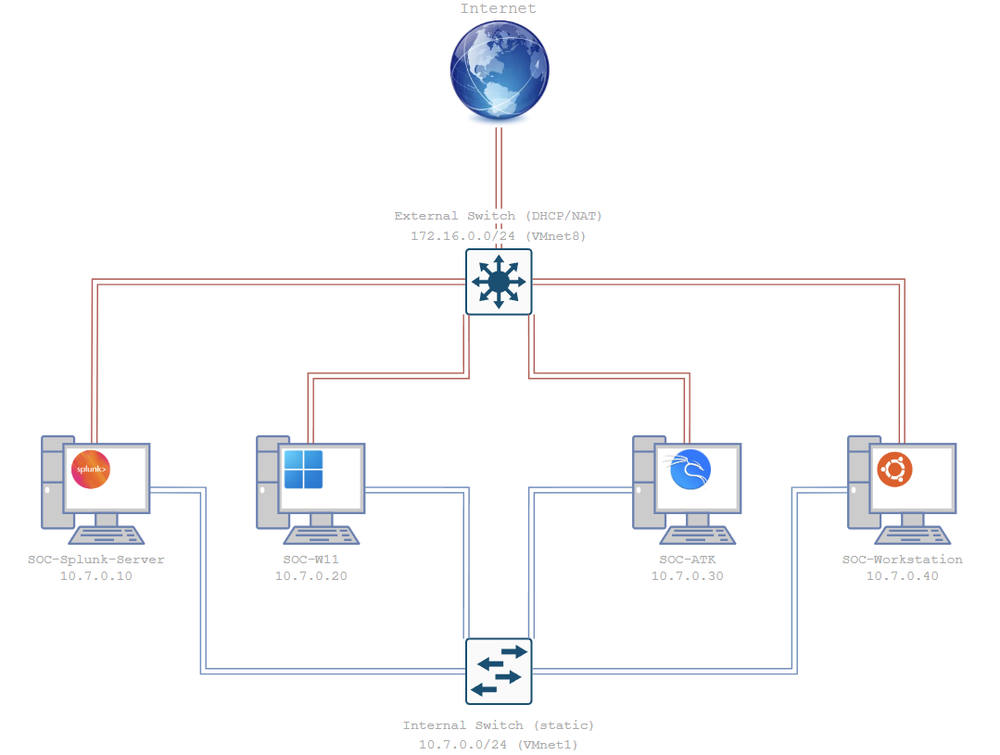

# 🛡️ SOC Lab avec Splunk

## 🎯 Objectif

Mettre en place un SOC miniature dans un environnement virtuel, en combinant :  
  - Splunk Enterprise comme SIEM  
  - Universal Forwarder sur une machine Windows victime  
  - Honeypot IIS exposant des leurres  
  - VM Kali pour simuler l’attaquant  
  - Station analyste pour le triage et la visualisation  

> 💡 Le but : tester de bout en bout un flux SOC ; collecte → détection → alerte → triage → visualisation.  

## 🖥️ Environnement
VMs : 
- SOC-Splunk-Server (`10.7.0.10`) : SIEM, collecte et corrélation des logs  
- SOC-W11 (`10.7.0.20`)  : Windows 11, victime avec honeypot IIS + Forwarder  
- SOC-ATK (`10.7.0.30`)  : Kali Linux, attaquant (reconnaissance & exfiltration simulée)  
- SOC-Workstation (`10.7.0.40`)  : Analyste SOC - Investigation et analyse  

Réseaux :  
- Host-Only (`10.7.0.0/24`) pour communication interne (isolé)   
- NAT (`172.16.0.0/24`) pour mises à jour/téléchargements temporaires

## ⚡ Workflow opérationnel

1. **Attaque** 
   - Scan réseau 
   - Accès aux leurres (`/really-confidential-data.html`, `robots.txt`)
   - Téléchargement fichier CSV (`totally-not-sensitive-2025.csv`)  

2. **Détection & Alerte** 
   - Splunk indexe les logs IIS (`iis_logs`)
   - Détection via SPL (URI ciblés)  
   - Alerte en temps réel → Notification e-mail (Mailtrap)  

3. **Triage & Investigation**  
   - Analyste SOC corrèle champs clés (`IP, User-Agent, URI, code HTTP`)  
   - Confirmation de la séquence kill chain  

4. **Visualisation**  
   - Dashboard Splunk → Vue en temps réel des accès honeypot  
   - Tableaux, graphiques, indicateurs d’accès  

## 📊 Résultats
  - Pipeline SOC complet : logs collectés, corrélés et visualisés.  
  - Alertes en temps réel : e-mail + Triggered Alerts + CSV lookup.  
  - Dashboard Splunk : suivi des accès honeypot, sources actives, tendances.  
  - Simulation adversaire : détection efficace d’une séquence reconnaissance → accès → exfiltration.

## 🧠 Leçons tirées

1. **Traces** : les attaques laissent des logs exploitables.  
2. **Contexte > événements isolés** : c’est la corrélation qui crée l’indicateur.  
3. **Chaîne SOC** : collecte → alerte → triage → dashboard, un tout cohérent.  
4. **Dashboards** = visibilité immédiate.  
5. **Mindset d'attaquant** : penser comme l’attaquant pour mieux détecter/protéger.  
 

## 📂 Documentation

➡️ **Guide des phases détaillées** : [👉 c'est ici!](GUIDE.md)

## ⚠️ Disclaimer

Ce projet est un lab pédagogique destiné à l’apprentissage et à la simulation de scénarios SOC.  
- Il ne constitue pas une solution de sécurité prête à l’emploi.  
- Les configurations et attaques simulées sont simplifiées à des fins d’étude.  

> 💡 Utiliser ce lab comme base d’entraînement ou de démonstration, mais pas comme substitut à une infrastructure SOC professionnelle.  

